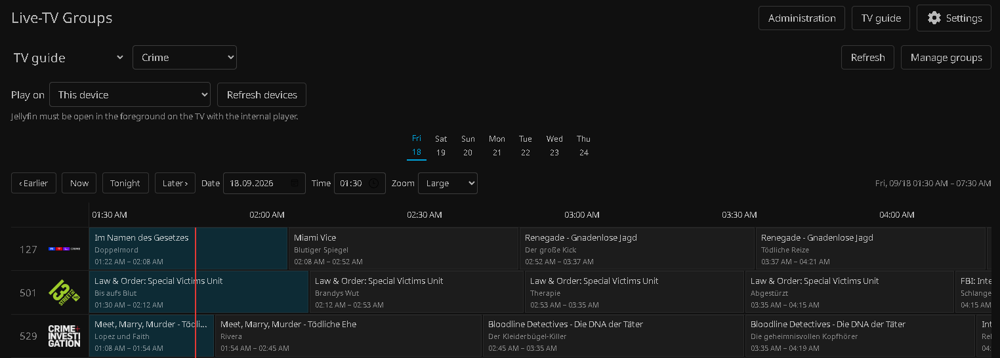
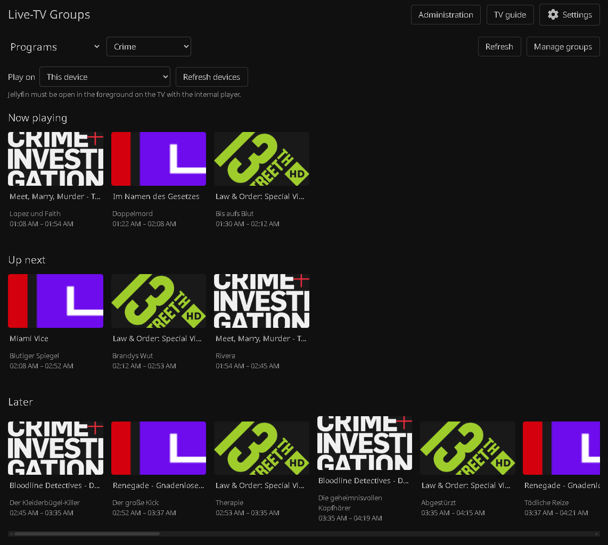
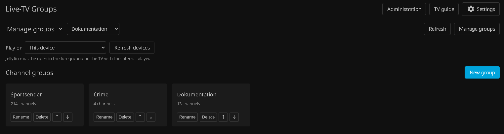
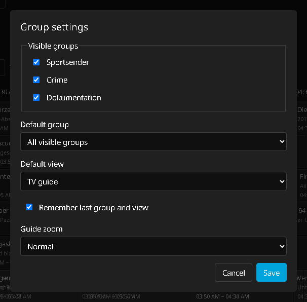
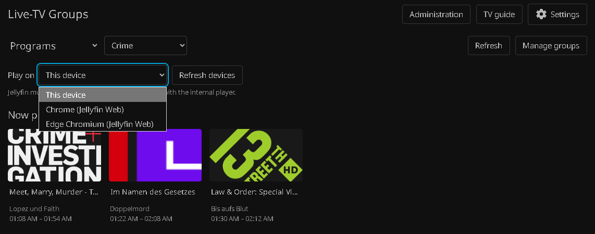
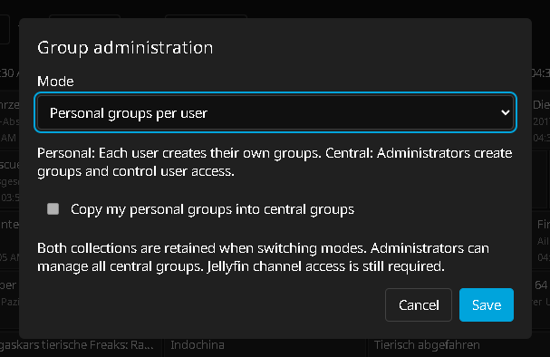

# Live-TV Groups for Jellyfin

Live-TV Groups goes beyond browsing provider-defined IPTV categories: users can manually create and order personal channel groups independently of the underlying M3U or Xtream categories. Administrators can optionally provide shared groups with per-group user access. The plugin combines this flexible organization with an independent program guide (EPG), remote playback on Jellyfin Android TV / Fire TV, grouped folders for native apps, and optional playlists.

Use channel groups to keep a large TV lineup easy to browse: collect channels by topic, language or household preference and view their schedules together. With a supported web-based Jellyfin phone app or mobile browser, your phone also becomes a TV guide and remote for Jellyfin Android TV / Fire TV. Browse programs on the phone, start a channel on the TV and switch channels without closing the guide.

**Stable version: 0.3.2.1** · **Server target: Jellyfin 12.0 / ABI 12.0.0.0** · **License: GPL-3.0**

The plugin uses Jellyfin's existing channels and EPG data. Its groups page works independently of the original Jellyfin Live TV views.

## Contents

- [Screenshots and preview](#screenshots-and-preview)
- [Requirements and client support](#requirements-and-client-support)
- [Installation](#installation)
- [Upgrading](#upgrading)
- [User permissions](#user-permissions)
- [Home screen entry](#home-screen-entry)
- [Language and display name](#language-and-display-name)
- [Quick start](#quick-start)
- [Phone as TV guide and remote](#phone-as-tv-guide-and-remote)
- [Personal and central groups](#personal-and-central-groups)
- [Creating and editing groups](#creating-and-editing-groups)
- [Views and program guide](#views-and-program-guide)
- [Remote playback](#remote-playback)
- [Native apps and program lists](#native-apps-and-program-lists)
- [Optional playlists](#optional-playlists)
- [Settings reference](#settings-reference)
- [Data storage and backups](#data-storage-and-backups)
- [Troubleshooting](#troubleshooting)
- [Support](#support)
- [License](#license)

## Screenshots and preview

Explore the independent groups page in Jellyfin Web. These screenshots show the English interface; custom group names and imported channel/program information keep their original language. Click any image to view it at full resolution.

### Grouped TV guide

[](assets/screenshots/tv-guide-epg.png)

Browse a selected group's EPG on a timeline, jump to another day or time, and adjust the guide zoom. Channel logos start playback on the selected device; program cells open Jellyfin's program details.

<details>
<summary>Programs overview</summary>

[](assets/screenshots/programs-overview.png)

See what is on now, what starts next and what airs later across the selected group's channels.

</details>

<details>
<summary>Group management</summary>

[](assets/screenshots/group-management.png)

Create named channel groups and keep them organized with rename, delete and ordering controls.

</details>

<details>
<summary>Personal settings</summary>

[](assets/screenshots/personal-settings.png)

Choose visible groups, the default group and view, whether to remember your last selection, and the guide zoom.

</details>

<details>
<summary>Playback device selection</summary>

[](assets/screenshots/playback-device-selection.png)

Choose where channel playback starts with **Play on**. This capture shows connected Jellyfin Web browser sessions. For Android TV / Fire TV requirements and setup, see [Remote playback](#remote-playback).

</details>

<details>
<summary>Group administration</summary>

[](assets/screenshots/group-administration.png)

Administrators can switch between personal and centrally managed groups, optionally copying their personal collection into central groups while preserving both collections.

</details>

## Requirements and client support

Configure working Live TV in Jellyfin before using the plugin. For program information, configure/import an EPG source and map it to the relevant channels. The plugin does not supply a new XMLTV feed.

| Component/client | Function |
| --- | --- |
| Jellyfin 12.0 server | Target server version; plugin ABI is 12.0.0.0. |
| Jellyfin Web on desktop/mobile | Independent groups page, timeline guide, group management and remote target selection. |
| Mobile clients loading the server's Jellyfin Web interface | Same web integration when the injected page script is loaded. Fully native clients do not automatically receive this UI. |
| Official Jellyfin Android TV app, including Fire TV | Group folders/native EPG lists and remote playback target with the app in the foreground and its internal player enabled. |
| Other apps with channel support | Group folders and native program lists, subject to the client's channel capabilities. |
| Playlist-based apps | Optional mirrored group playlists, subject to the client's support for these media items. |
| File Transformation plugin | Required for injecting the independent web interface. |
| Plugin Pages 3.x | Optional user-menu shortcut; does not replace File Transformation. |

Remote playback requires the internal player in the official Jellyfin Android TV app. External players are not supported.

The interface supports English and German. This documentation uses the English labels.

## Installation

### Stable plugin repository

1. Open **Dashboard → Plugins → Repositories** and add a repository using this URL:

   ```text
   https://github.com/iEnki/jellyfin-plugin-livetv-groups/releases/latest/download/manifest.json
   ```

2. Add the File Transformation repository:

   ```text
   https://www.iamparadox.dev/jellyfin/plugins/manifest.json
   ```

3. Install **Live-TV Groups** and a **File Transformation** version compatible with your Jellyfin server.
4. Restart Jellyfin.
5. Open **Dashboard → Plugins → Live-TV Groups**. Verify web integration is enabled and check the integration status.
6. Grant intended users access to the **Live-TV Groups** channel; see [User permissions](#user-permissions).
7. Reload Jellyfin Web or close/reopen the web-based mobile client. Open **Live-TV Groups** under **My Media** or the client's channel/library section.

When compatible Plugin Pages is installed and web integration is registered, a user-menu shortcut is registered automatically. The channel/library entry remains available without Plugin Pages.

### Optional beta repository

To test features before their stable release, add this separate repository under **Dashboard → Plugins → Repositories**:

```text
https://github.com/iEnki/jellyfin-plugin-livetv-groups/releases/download/beta-channel/manifest-beta.json
```

Install or update **Live-TV Groups** from the plugin catalog and restart Jellyfin. Beta builds use the same plugin identity and preserve existing settings and groups. The beta catalog includes stable versions as well as newer beta versions; the existing development repository also receives beta builds.

Jellyfin compares four-part numeric versions. Beta updates and a later stable release need higher version numbers to be offered as updates. Removing the beta repository stops future beta offers; it does not downgrade an already installed beta. To return to stable immediately, follow manual installation and preserve plugin data/configuration.

### Manual installation

1. Download the plugin ZIP from the [latest release](https://github.com/iEnki/jellyfin-plugin-livetv-groups/releases/latest).
2. Stop Jellyfin and preserve the plugin data/configuration.
3. Move the older binary installation outside the scanned plugins directory.
4. Create a folder such as `Live-TV Groups_<version>` inside Jellyfin's plugins directory.
5. Extract **both** `Jellyfin.Plugin.LiveTvGroups.dll` and `meta.json` into it. Keep only one installed binary copy.
6. Start Jellyfin and confirm the installed version.

The package contains matching plugin identity/version metadata and automatic update support. Add the stable repository to receive subsequent stable updates.

## Upgrading

Install updates from the plugin catalog under **Dashboard → Plugins**.

Install the offered update and restart Jellyfin. Your groups, channel order, access rules, display preferences and selected player are preserved.

Reload the browser/mobile web client and fully close/reopen the TV app to clear stale scripts and listings.

For upgrades from older stable versions, personal groups are preserved and personal mode remains the default. Central mode is an explicit administrator choice.

The previous 0.2.x native Live TV/guide filter is no longer active. Old filter settings and guide-group selections do not filter original Live TV. Use the independent groups page or native group folders.

## User permissions

Jellyfin channel access and plugin group visibility are separate permission layers.

### Allow access to the plugin channel

An ordinary user needs Live TV access **and** access to the separate plugin channel:

1. Open **Dashboard → Users → affected user → Access**.
2. Under **Channels**, explicitly allow **Live-TV Groups**, or choose an appropriate all-channels policy.
3. Save.
4. Sign the user out and back in.

A user may be allowed to watch ordinary Live TV while the plugin entry is missing under My Media. Granting the plugin channel resolves that case.

Jellyfin media playback rights, disabled-account restrictions, channel access and parental controls continue to apply.

### Group visibility

- Personal mode exposes that user's own groups.
- Central mode exposes groups allowed by their user policies.
- Administrators retain access to manage all central groups.
- Personal display hiding is a preference; administrator group exclusions are access rules.

Group rules apply to the plugin guide, native group/EPG folders, plugin stream resolution/opening and central-group remote playback. They do not remove access to the same channels in original Jellyfin Live TV. A channel also present in another allowed group remains accessible through that group.

The plugin does not automatically change Jellyfin user/channel policies.

## Home screen entry

Administrators can optionally hide the original **Live TV** tile or library button under **My Media**, leaving **Live-TV Groups** as the entry for browsing grouped channels and their program guide.

1. Open **Dashboard → Plugins → Live-TV Groups**.
2. Enable **Hide the original Live TV entry on the web home screen** and save.
3. Reload Jellyfin Web or reopen web-based mobile clients.

The option is disabled by default and applies to all users of the web interface. It requires web integration, the app channel and user access to the plugin channel. The original Live TV entry is hidden only when an accessible groups entry is visible in the same My Media section. If that entry is missing or unavailable, original Live TV remains visible.

This changes the web home screen only. The normal Live TV menu, recordings, schedules, permissions and streaming remain available. Native Smart TV, Android TV and Fire TV apps retain their existing home screens, group folders and playback. Fully native mobile clients are also unaffected. Disable the option and reload clients to restore the original web home entry.

## Language and display name

The web page and administrator settings follow the **Display language** selected in Jellyfin. English and German are included; other languages use English interface text. Dates and times follow the active client locale and the documented guide timezone. Channel names, group names and imported EPG titles/descriptions are not translated.

The shared channel/library entry has one name for the server. With no custom name, it uses the server's **Preferred display language**. The web page uses the current client's display language. Native app guide text uses the language sent by the client, falling back to the server language when the client does not supply one.

To choose your own name:

1. Open **Dashboard → Plugins → Live-TV Groups**.
2. Enter **Display name**, for example **Family TV**. Leave it empty to restore the translated default.
3. Save. The channel/library name updates within approximately 30 seconds.
4. Reload browser/mobile clients or refresh the TV app. Restart Jellyfin to update the optional Plugin Pages menu shortcut.

A custom name is shared by all users and appears in the channel/library entry, web page title and optional menu shortcut. The plugin catalog and dashboard plugin name remain **Live-TV Groups**. Renaming preserves the channel identity, user permissions, groups and playlist mappings. The maximum length is 100 characters.

## Quick start

### Personal groups

1. Open **Live-TV Groups → Manage groups**.
2. Select **New group**, enter a name and save.
3. Select **Choose channels**, select/search for channels, and save.
4. Open **TV guide** to view the timeline.

### Shared groups for users

1. As administrator, open **Dashboard → Plugins → Live-TV Groups**.
2. Under **Group administration**, select **Central groups managed by admins**.
3. Optionally check **Copy my personal groups into central groups** to copy your existing personal groups.
4. Save, then open **Live-TV Groups → Manage groups**.
5. Create/edit central groups and configure **User access** per group.
6. Ensure intended users have Jellyfin access to the plugin channel.

The groups-page **Administration** dialog also offers the mode/copy controls.

### Phone as TV guide and remote

Use your phone as a remote to start and switch Live TV channels on your TV. The grouped program guide makes it easier to find what to watch when you have many channels, while the TV continues playing. This works in Jellyfin mobile apps that load the server's web interface and in a mobile browser; see [Requirements and client support](#requirements-and-client-support).

1. Open Jellyfin on Fire TV with the internal player enabled.
2. Use the same Jellyfin account on phone and TV for the simplest setup.
3. On the phone, open **Live-TV Groups → TV guide**.
4. Refresh devices and choose the TV under **Play on**.
5. Tap a channel number/logo to start it on the TV. The phone keeps the guide open while the TV plays.
6. To switch channels, browse your groups and tap another channel number/logo. Playback changes on the selected TV; the guide remains open on your phone.

## Personal and central groups

| Mode | Collection | Editing | Visibility |
| --- | --- | --- | --- |
| **Personal groups per user** | Separate collection for each user. | The owner edits their own collection. | That user. |
| **Central groups managed by admins** | One shared server-wide collection. | Administrators. | Users allowed per group, plus administrators. |

Switching modes preserves both collections. Enabling central mode does not delete personal groups; returning to personal mode does not delete central groups.

The optional copy operation preserves group IDs/channel order, keeps personal originals and skips IDs already present in the central collection. It does not overwrite previously imported central groups.

### Central user access

Use **Manage groups → User access** on a central group:

| Policy | Meaning of checked users |
| --- | --- |
| **All users except selected** | Checked users are excluded; other eligible users can see the group. |
| **Selected users only** | Checked users are allowed; other ordinary users cannot see the group. |

Administrators are labeled as always having management access. An explicit exclusion takes precedence over an allowance. A group policy does not grant ordinary Live TV rights to an otherwise restricted/disabled user.

Use **Refresh** on an already open page to reload the current mode and visible groups. Refresh or reopen the TV app if it still shows an older group listing.

## Creating and editing groups

Users with editing permission can:

- Create groups with a nonempty name of up to 100 characters.
- Rename/delete groups.
- Search/select channels that Jellyfin permits the editing user to access.
- Filter the picker with **Selected channels only**.
- Reorder groups by drag-and-drop or up/down buttons.
- Reorder a specific group's channels through **Change order**.
- Open a group directly from its management card.

Deleting a group removes grouping information, not the underlying Jellyfin channels. Obsolete mirrored playlists are removed during synchronization.

**All visible groups** is a combined viewing scope. Channel editing requires a specific group. Central mode gives ordinary users read-only group content, playback controls and personal settings.

## Views and program guide

The selected group applies to all three views. **All visible groups** combines personally visible, authorized groups and removes duplicate channels.

| View | UI label | Content |
| --- | --- | --- |
| Programs | **Programs** | Current, next and later programs in the loaded window. |
| Timeline guide | **TV guide** | Channels/programs on a time axis. |
| Channel cards | **Channels** | Channel numbers/logos and current programs when available. |

### Timeline features

- Six-hour time window and 30-minute time labels.
- Seven calendar-day buttons, date/time inputs and earlier/later navigation.
- **Now** and **Tonight** shortcuts.
- Compact, normal or large zoom.
- Current-time indicator and live-program highlighting.
- Horizontal scrolling with readable captions on narrow screens.
- Preserved group, guide window and scroll state when returning from program details.
- Guide data refresh approximately every five minutes while an active viewing screen is running.

Web times use the device/browser timezone. Native app lists use the administrator's app-guide timezone.

A **program cell/card** opens Jellyfin's ordinary details page. A **channel number/logo** in the guide or a **channel card** starts playback on the chosen target. Playback buttons on native program details belong to Jellyfin and are not redirected by the plugin target selector.

The direct **TV guide** button opens the timeline. A user seeing channel cards in Channels view does not lack EPG permission merely because the timeline is not selected.

### Missing data

The plugin reads Jellyfin's imported EPG. It does not obtain a new XMLTV feed or create catch-up recordings.

Empty rows can mean no programs exist for that channel/time period. The guide reports unresolved saved channels and discarded incomplete program records. A saved group's channel count can exceed the count currently accessible to a restricted user.

## Remote playback

The phone guide acts as a Live TV remote: selecting a channel starts or changes playback on the selected TV, while you keep browsing the grouped schedule on your phone.

### Supported target

The supported remote target is official Jellyfin Android TV / Fire TV, **open in the foreground with the internal player**. No TV wake-up or automatic app launch is provided.

Keep the Jellyfin TV app open on screen. If an external player is configured, switch to the internal player before using remote playback.

### Target selection

- **Play on** chooses the output device.
- **Refresh devices** reloads connected, authorized targets.
- **This device** restores the current browser/mobile client's playback behavior.
- Device ID and server-reported name are saved per user.
- An offline preferred TV remains selected and displays an unavailable warning.
- Remote errors remain on the guide and do not silently fall back to playback on the phone.
- Device discovery refreshes approximately every minute while an active viewing screen is running.

The target list includes connected, authorized players. Official Android TV / Fire TV devices can appear even if the client does not advertise remote-control support.

The preferred device is remembered for each user. Reopening the TV app does not require selecting it again when Jellyfin recognizes the same device.

### Accounts and rights

The simplest configuration uses the same user on phone and TV.

To control a TV signed in as another user, an administrator must allow the controlling account to remotely control other users in Jellyfin's user settings. Both users need Live TV/media playback permission and access to the requested channel. In central mode, both must also have that channel in an authorized group.

### Switching a running channel

Tap the new channel once. The plugin stops the current stream and starts the selected channel after the player is ready. A brief pause while switching is normal.

If the TV disconnects or does not confirm that playback stopped, the guide displays an error. Reopen the TV app, refresh devices and try again.

Successful command delivery does not prove that a tuner stream opened or that video was displayed. Check the TV and server logs if a command succeeds without playback.

This version provides start/switch actions, not a separate pause/volume/stop remote-control panel.

## Native apps and program lists

Apps with channel support can browse:

```text
Channels / My Media
└── Live-TV Groups
    └── Group
        ├── Channel
        └── TV guide
            └── Day
                └── Channel
                    └── Program
                        └── watch live
```

The native EPG contains seven local calendar days, channel lists, timing, episode information and descriptions. Day boundaries follow the configured timezone, including daylight-saving changes.

**watch live** starts the current live stream. Selecting a past/future program does not play a recording or catch-up stream.

The stock Fire TV / Android TV client uses browsable folders for this guide. It does not render the browser timeline inside the native TV app. Original Jellyfin Live TV/its timeline remain independent.

Grouped playback uses Jellyfin's Live TV streaming and transcoding. Users can play only channels permitted by their Jellyfin account and, in central mode, the group's access policy.

## Optional playlists

Enable **Also create group playlists** for clients with playlists but no channel interface.

Each visible group is mirrored as **Live-TV: Group name** for its relevant user. Entries reference the plugin's grouped media items; native Live TV channels cannot simply be added as ordinary playlist items.

- Requires the app channel setting.
- Synchronizes shortly after edits, at startup and on a default six-hour schedule.
- Mode/central group/access-policy changes schedule user synchronization.
- Removes obsolete mirrors for deleted or no-longer-visible groups.
- Turning the feature off removes plugin-created mirrors.
- Manual task: **Synchronize Live-TV Groups playlists**.

Playlist mappings remain per user even when the collection is central. Client playback capabilities still apply; Wholphin is an intended playlist-based entry use case.

## Settings reference

### Administrator settings

Location: **Dashboard → Plugins → Live-TV Groups**.

| Setting | Default | Effect |
| --- | --- | --- |
| Display name | Automatic | Translated default, or an administrator-defined name shared by all users. |
| Group administration | Personal | Choose personal or central ownership; also available in groups-page administration. |
| Copy personal groups | Unchecked | Copy admin personal groups into the central collection without deleting originals. |
| Web integration | Enabled | Inject the independent web page through File Transformation. Restart after changing integration registration settings. |
| Hide original Live TV home entry | Disabled | Hide only the original My Media tile/button in web clients when an accessible groups entry is visible. Reload clients after changing. |
| App channel | Enabled | Offer groups to native apps. It also remains available as a web entry while web integration is enabled. |
| App-guide timezone | Europe/Vienna | Timezone for native EPG lists; examples: Europe/Berlin or UTC. |
| Playlist sync | Disabled | Mirror visible groups as user playlists; requires app channel. |
| Integration status | Read-only | File Transformation and optional Plugin Pages detection/registration status/errors. |
| Central group user policy | All eligible users for a new group | Edit through **Manage groups → User access**. |

Successful server registration does not prove that a client loaded the injected script.

### Personal settings

Location: **Settings** on the groups page. These remain personal in both modes.

| Setting | Default | Effect |
| --- | --- | --- |
| Visible groups | All authorized groups | Hide from the selector/combined scope without deletion or a security-policy change. |
| Default group | All visible groups | Starting group when remembering is disabled. |
| Default view | Timeline guide | Starting Programs/Guide/Channels view when remembering is disabled. |
| Remember last group/view | Enabled | Reopen the last viewing selection; management is not a remembered normal view. |
| EPG zoom | Normal | Compact, normal or large time-axis spacing. |
| Preferred player | This device | Saved automatically by the target selector, independently of display preferences. |

## Data storage and backups

Data is stored in the `users` subdirectory of the plugin's Jellyfin data folder:

```text
<plugin data folder>/
└── users/
    ├── <user-id-without-hyphens>.json
    └── administration.json
```

Per-user files contain personal groups, ordered channel references, personal preferences, preferred device identity/name and playlist mappings. The central file contains the operating mode, shared groups and access policies.

This data directory is separate from a versioned binary installation directory. Preserve the complete data folder and Jellyfin-managed plugin configuration when upgrading/moving the server. Stop Jellyfin before restoring a backup to prevent ongoing changes from overwriting restored files.

If a tuner rescan/M3U re-import changes channel IDs, references can be matched using stored IDs, names and numbers. If a channel cannot be matched, open **Choose channels** and select its replacement.

## Troubleshooting

| Symptom | Action |
| --- | --- |
| Ordinary user cannot find Live-TV Groups in My Media | Allow the plugin channel under **Users → Access → Channels**, save and sign out/in. Ordinary Live TV access alone is insufficient. Also check personal home/library visibility. |
| Channel cards appear instead of EPG | Select **TV guide** or its direct button. **Channels** is a separate, possibly remembered view. |
| No groups for a user | Personal mode may have no groups for that account. In central mode check group policy and Jellyfin rights; refresh after changes. |
| Native folders appear instead of custom web UI | Check File Transformation, web integration/status, restart and browser reload/cache. Plugin Pages alone does not inject the interface. |
| Channels have no programs | Check imported EPG, channel mapping, selected time/date and ordinary Jellyfin Live TV. |
| Saved channel missing | Check user/parental rights, tuner availability and rescan matching; correct unresolved references through channel selection. |
| Fire TV absent from target list | Open Jellyfin in the foreground, use the same account or grant cross-user remote permission, then refresh. Ensure the TV app is connected to your Jellyfin server. |
| Remembered target unavailable | Reopen the TV app and refresh devices. The preference intentionally does not switch to local playback. |
| No stop confirmation on sender change | Check TV connection/internal-player setting. Reopen the TV app and retry. The selected channel starts only after the current player has stopped. |
| Command succeeds but no picture | Check TV/internal player, ordinary playback of the same sender, tuner/transcoding and matching server logs. |
| Native listing stale | Fully close/reopen or refresh the app. The app may keep a cached group listing. |
| Playlists missing/outdated | Enable app channel/playlist sync, check group access and run the manual synchronization task. |
| Old version after manual installation | Remove duplicate binary installations, use matching DLL/meta.json in the versioned folder and restart. |

For an issue report, include server/plugin/client versions, mode, affected accounts, channel, approximate time, displayed error and relevant log excerpts. State whether phone, TV or both are affected, and whether ordinary Live TV plays the channel.

## Support

If you encounter a problem, open an issue in the [GitHub issue tracker](https://github.com/iEnki/jellyfin-plugin-livetv-groups/issues). Include the information listed above and remove passwords, access tokens and other private information from logs.

See [CHANGELOG.md](CHANGELOG.md) for release history.

## License

Live-TV Groups is distributed under the [GNU General Public License v3.0](LICENSE).
